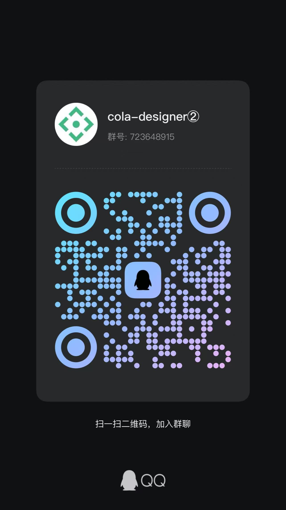

# 简介
Cola-Designer 是一个 基于VUE，实现拖拽 + 配置方式生成数据大屏，为简化开发、提高效率而生。

AD：现已推出商业版，在线体验链接：http://cola.icelery.fun/

用户名：demo

密码：123456

#

在线体验地址：<a href="http://colaiven.gitee.io/cola-designer/#/design" target="_blank">cola-designer/#/design</a>   
（没钱买服务器暂时只能体验前端，联合后端可自行拉取代码运行体验）   

文档地址：<a href="https://colaiven.gitee.io/cola-designer-doc/" target="_blank">cola-designer-doc</a>   

前端仓库：<a href="https://gitee.com/colaiven/cola-designer" target="_blank">cola-designer</a>   

后端仓库：<a href="https://gitee.com/colaiven/cola-designer-java" target="_blank">cola-designer-java</a>  

## 特性
* 0 代码：
   * 实现完全拖拽 + 配置式生成大屏，设计即生产。（动态数据需要后端提供API接口）
* 快速开发&部署：
   * 项目采用行业流行架构：SpringBoot+Vue，开发\部署方便。
* 组件丰富:
   * 内置element、dataV、echarts等优秀开源的报表常用组件，满足基本的设计需求。
* 自定义：
   * 设计器没有想要的组件？自己动手，丰衣足食。详细文档介绍5分钟可开发一个自己想要的组件。

## 概览
部分截图：

注意事项：项目默认使用接口模式，完整功能需要连接后端程序，若只想体验设计器部分可将env.js中active改为preview（本地缓存模式），然后访问http://localhost:8009/#/design  ，本地缓存模式暂时不能使用图片上传

PS:由于种种原因，本人将不再提交开源版本新功能代码，有兴趣加入协同开发贡献代码的大佬可以滴滴我，QQ群：    

--- 劳烦路过的大佬点个star吧 ---

